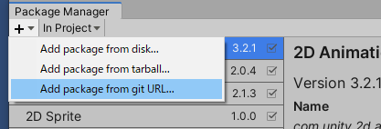
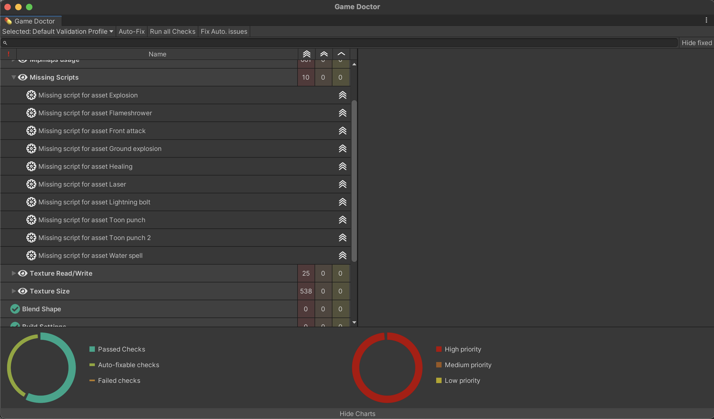
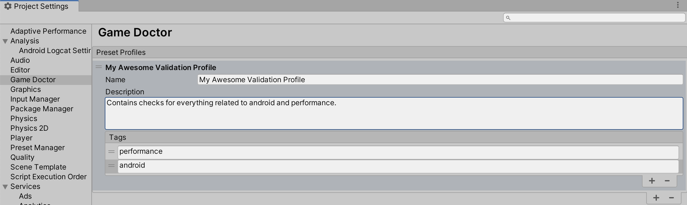

💊 Game Doctor
==================================

An all in one tool to scan a Unity project and fix things. Ranging from performance optimisations to missing analytics.

  * [Installation](#installation)
    + [Install via git URL](#install-via-git-url)
    + [Install via OpenUPM](#install-via-openupm)
  * [Basic usage of Game Doctor](#basic-usage-of-game-doctor)
    + [Validation Profiles](#validation-profiles)
  * [Creating your own checks](#creating-your-own-checks)
  * [How to contribute](#how-to-contribute)
  * [License](#license)


## Installation
### Install via git URL

You can add `https://github.com/homagames/hg-mobile-unitypackage-game-doctor.git` to Package Manager




If you want to set a target version, Game Doctor uses the `v*.*.*` release tag so you can specify a version like `#v2.1.0`. For example `https://github.com/homagames/hg-mobile-unitypackage-game-doctor.git#v2.1.0`.

### Install via OpenUPM

The package is available on the [openupm registry](https://openupm.com). It's recommended to install it via [openupm-cli](https://github.com/openupm/openupm-cli).

```
openupm add com.homagames.gamedoctor
```

## Basic usage of Game Doctor
Go to **Window > Homa Games > Game Doctor > Open Default Profile**.
##### Game Doctor main window : 


TODO : add a video of an actual fixing process with real checks

### Validation Profiles
Game Doctor groups checks using Validation Profiles, they are a way to regroup checks and executing them together.

The Default Validation Profile contains all checks registered in the project. 

Game Doctor also comes with a [Tag based Validation Profile](Editor/Core/Implementation/TagBasedValidationProfile.cs).

Those are looking for all checks in the project having specific tags and they can easily be created in the Game Doctor Settings window :



## Creating your own checks
You can create your own checks, issues and validation profile, by implementing [ICheck](Editor/Core/Model/ICheck.cs), [IIssue](Editor/Core/Model/IIssue.cs) and [IValidationProfile](Editor/Core/Model/IValidationProfile.cs).

If you want your checks or validation profiles to be available in the main Game Doctor window, use the [AvailableChecks](Editor/Core/Utilities/AvailableChecks.cs) and [AvailableProfiles](Editor/Core/Utilities/AvailableProfiles.cs) API :
```csharp
// The simplest place to call the register functions are on assembly reload using [InitializeOnLoadMethod]
AvailableChecks.RegisterCheck(myCheck);
AvailableProfiles.RegisterValidationProfile(myValidationProfile);
```

Hyperlink are available for profile, check and issue descriptions. 2 types of links are supported:
* The regular HTML hyperlink format `<a href="[URL]">content</a>`, which will open the given URL in the user's browser,
* A special asset link `<a asset="[AssetPath]">content</a>`, which will ping the object at the given path.

Here are examples of how to create a simple checks :
##### Creating a Check : 
```csharp
using System.Collections.Generic;
using System.Threading.Tasks;
using HomaGames.GameDoctor.Core;
using UnityEditor;

// This checks if the Android Target SDK is set to Auto.
public class AndroidSettingsCheck : BaseCheck
{
    // Make sure to register the checks you created to the AvailableChecks API
    [InitializeOnLoadMethod]
    public static void RegisterCheck()
    {
        AvailableChecks.RegisterCheck(new AndroidSettingsCheck("settings"));
    }

    public AndroidSettingsCheck(params string[] tags) : base(
        "Android API Check",
        "Making sure Android Settings are right", new HashSet<string>(tags))
    {
    }

    // Generate a check result that contains potential issues
    protected override Task<CheckResult> GenerateCheckResult()
    {
        var result = new CheckResult();
        if (PlayerSettings.Android.targetSdkVersion != AndroidSdkVersions.AndroidApiLevelAuto)
            result.Issues.Add(
                // The issue can contain a fix for itself
                new SimpleIssue(() =>
                    {
                        PlayerSettings.Android.targetSdkVersion = AndroidSdkVersions.AndroidApiLevelAuto;
                        return Task.FromResult(true);
                    },
                    "Wrong Android Target SDK", "Android Target SDK Version not set to Automatic."
                    , AutomationType.Automatic)
            );
        return Task.FromResult(result);
    }
}
```

You cannot always automatically fix issues for the user, and for those cases you need to create an interactive issue.

That's when [StepBasedIssue](Editor/Core/Implementation/StepBasedIssue.cs) comes in handy :

##### Same check but with an interactive issue :
```csharp
    protected override Task<CheckResult> GenerateCheckResult()
    {
        var result = new CheckResult();
        if (PlayerSettings.Android.targetSdkVersion != AndroidSdkVersions.AndroidApiLevelAuto)
            result.Issues.Add(
                new StepBasedIssue(new List<Step>()
                    {
                        new Step(
                            () => PlayerSettings.Android.targetSdkVersion == AndroidSdkVersions.AndroidApiLevelAuto,
                            "Android API Level",
                            "Please, go in ProjectSettings>Player and change Android API Level to Auto"),
                        // We always have a nice day with Game Doctor
                        new Step(() => true, "Have a nice day")
                    },
                    "Wrong Android Target SDK", "Android Target SDK Version not set to Automatic.")
            );
        return Task.FromResult(result);
    }
```

The example above will give you this popup window in the fixing process :


https://user-images.githubusercontent.com/69792951/180445274-c1cdf04c-69cf-4a06-8b51-04b6dbc8fff5.mov


## How to contribute
If you want a new feature, or noticed a bug in Game Doctor, you can create a new issue [here](https://github.com/homagames/hg-mobile-unitypackage-game-doctor/issues).

You're more than welcome to help us tackle existing issues !

The easiest way to get started on your first Pull Request is doing the following :

 1. Clone the content of this repository to your **Packages/** folder.
 2. Make changes to the cloned repository
 3. Push your changes to a **new branch** and do a Pull Request


## License
[GPLv3](COPYING.md)
